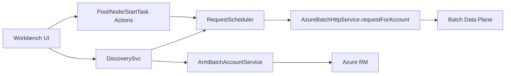

# AGENTS.md

## Mission

Upgrade **BatchExplorer** into a production-grade **Pool Control Workbench**.

Target scope:

- all subscriptions
- all existing Azure Batch accounts
- all regions represented by those Batch accounts

Do not auto-create Batch accounts.  
Do not break existing flows.  
Reuse existing repo patterns for UI, services, config, auth, and testing.

---

## Execution Mode

- Work on **exactly one phase** per run: `P0` to `P9`
- Do **not** continue to the next phase automatically
- Do **not** widen scope beyond the current phase
- Stop immediately on build failure or test failure
- Preserve backward compatibility at every phase

---

## Response Contract

For every phase, return output in this exact order:

1. **Executive Summary**
   - 3 to 5 sentences
   - first person
   - explain what I checked or changed and why

2. **Changed Files**
   - repo-relative paths only
   - if no changes: `None`

3. **Full Files**
   - output only full contents of new or modified files
   - never output partial snippets
   - if no changes: `None`

4. **Validation**
   - for code-changing phases, run:
     - `npm run build:desktop`
     - `npm run test:desktop`
   - report results
   - stop

### P0 exception

For `P0`, output only:

- Executive Summary
- Changed Files: `None`
- Full Files: `None`
- plan, service-boundary validation, extension points, compatibility notes, and risks

`P0` makes **no code changes**.

---

## Non-Negotiable Rules

- Change **one logical area** per phase
- Extend behavior; do not replace working behavior
- Keep existing flows working
- Use repo-native patterns before adding new patterns
- No uncontrolled loops
- No uncontrolled fan-out
- No burst traffic across subscriptions, accounts, or regions
- Do not eagerly load node lists during discovery
- Lazy-load nodes only when needed by the UI

---

## Anti-429 Rules

All new multi-account and multi-region logic must follow these rules:

- default execution is sequential
- concurrency must be bounded and config-driven
- apply pacing delay between scheduled requests
- honor `Retry-After` when present
- otherwise use exponential backoff
- add jitter to backoff
- retry only throttling/transient failures selectively
- never use uncontrolled `Promise.all` across discovered accounts
- never do burst discovery or burst mutations

Baseline execution policy:

```yaml
execution:
  concurrency: 1
  retryAttempts: 5
  retryBackoffSeconds: [2, 4, 8, 16, 32]
```

---

## Azure Batch Constraints

Enforce these in code and docs:

1. Resize only when pool `allocationState === "steady"`
   - otherwise expect `409`

2. `remove-nodes` accepts at most **100 node IDs per request**
   - large removals must be chunked

3. Quotas vary by region and subscription
   - quota may be `0`
   - quota failure must stop the relevant action and be summarized

4. All polling must have:
   - timeout
   - max attempts

---

## Decision Log Baseline

Use this baseline unless the current phase explicitly changes it.

```yaml
features:
  multiRegionPoolBootstrap: false

scope:
  includeExistingBatchAccountsOnly: true
  autoCreateBatchAccountsPerRegion: false

pool:
  idPattern: "bootstrap-{location}-{yyyyMMdd-HHmm}-{rand4}"
  nodeType: dedicated
  vmSize: Standard_D2s_v3
  image: UbuntuLTS
  maxTargetPerAccount: 20

execution:
  concurrency: 1
  provisioningTimeoutMinutes: 20
  waitForIdleTimeoutMinutes: 10
  retryAttempts: 5
  retryBackoffSeconds: [2, 4, 8, 16, 32]

policy:
  runningNodeAction: manual-review-after-3-polls
  cleanupAfterRun: false
```

---

## Authoritative Repo Files

Use these files as the primary extension points.

### Configuration

- `desktop/src/common/be-user-configuration.model.ts`
- `desktop/src/client/core/user-configuration/main-configuration-store.ts`

### Azure Batch HTTP

- `desktop/src/app/services/azure-batch/core/batch-http.service.ts`

### ARM account discovery

- `desktop/src/app/services/batch-account/arm-batch-account.service.ts`

### Existing pool and node services

- `desktop/src/app/services/azure-batch/pool/pool.service.ts`
- `desktop/src/app/services/azure-batch/node/node.service.ts`

### Supported images pattern

- `desktop/src/app/services/azure-batch/pool-os/pool-os.service.ts`

### Models and DTOs

- `desktop/src/app/models/azure-batch/node/node.ts`
- `desktop/src/app/models/azure-batch/pool/pool.ts`
- `desktop/src/app/models/dtos/pool-create/pool-create.dto.ts`

### Entry point and UI hook

- `desktop/src/app/components/pool/home/pool-home.component.ts`
- `desktop/src/app/components/pool/home/pool-home.component.html`

### Test harness

- `desktop/karma.conf.js`

---

## Required Configuration Shape

Add these configuration fields without breaking existing config consumers.

```ts
features: {
  poolControlWorkbench: boolean
  multiRegionPoolBootstrap: boolean
}

poolControlWorkbench: {
  throttling: {
    concurrency: number
    delayMs: number
    retryAttempts: number
    retryBackoffSeconds: number[]
    jitterPct: number
  }
  refresh: {
    autoRefreshEnabled: boolean
    autoRefreshIntervalSeconds: number
  }
}
```

---

## Required Service Behavior

### Batch HTTP

Add account-aware data-plane requests in:

- `desktop/src/app/services/azure-batch/core/batch-http.service.ts`

Required method:

```ts
public requestForAccount(account: BatchAccount, method: any, uri?: any, options?: any): Observable<any>
```

Rules:

- keep existing `request()` unchanged
- use existing auth patterns
- support existing account types
- preserve current callers

Reference shape:

```ts
public requestForAccount(account: BatchAccount, method: any, uri?: any, options?: any): Observable<any> {
  options = this._addApiVersion(uri, options)
  const url = this._computeUrl(uri, account)
  const auth$ = account instanceof ArmBatchAccount
    ? this._setupRequestForArm(account, options)
    : this._setupRequestForSharedKey(account as any, method, url, options)

  return auth$.pipe(
    mergeMap(opts => super.request(method, url, opts).pipe(retryWhen(a => this.retryWhen(a)))),
    shareReplay(1)
  )
}
```

### Scheduler

All multi-account and bulk work must go through a scheduler service.

Rules:

- default concurrency `1`
- pacing delay
- exponential backoff
- honor `Retry-After`
- bounded retries
- no unbounded queue growth
- produce stable, testable behavior

### Discovery

Discovery must:

- enumerate existing Batch accounts across subscriptions
- aggregate pool-level counts
- not fetch nodes for every pool
- lazy-load nodes only when a user opens details or selects a row

### Workbench UI

Workbench must:

- be behind a feature flag
- add a navigation entry from pool home
- keep the existing button and flow
- provide master table, filters, selection, detail panel, and progress/summary views

---

## Required Helper Patterns

### Bootstrap pool create DTO

```ts
function buildBootstrapPoolCreateDto(
  poolId: string,
  vmSize: string,
  nodeAgentSKUId: string,
  imageRef: any
): PoolCreateDto {
  return new PoolCreateDto({
    id: poolId,
    vmSize,
    targetDedicatedNodes: 0,
    enableAutoScale: false,
    virtualMachineConfiguration: {
      nodeAgentSKUId,
      imageReference: imageRef
    },
    startTask: {
      commandLine: '/bin/bash -c "echo bootstrap-ok"',
      waitForSuccess: true
    }
  } as any)
}
```

### Remove-nodes chunking

```ts
const chunk = (xs, n = 100) =>
  Array.from({ length: Math.ceil(xs.length / n) }, (_, i) => xs.slice(i * n, i * n + n))

async function removeNodesChunked(account, poolId, nodeIds) {
  for (const part of chunk(nodeIds, 100)) {
    await post(`/pools/${poolId}/removenodes`, { nodeList: part })
  }
}
```

### Resize and poll discipline

```ts
for target = 1..maxTarget:
  await waitUntil(pool.allocationState === "steady", provisioningTimeout)
  await retryBackoff(() => resizePool(target))
  await pollUntil(
    () => poolSteady && currentDedicatedNodes == target && allNodesIdle,
    waitForIdleTimeout
  )
  if quota/resize failure:
    stopReason = "quota-or-resize-failure"
    break
```

---

## Required Summary Model

Use a per-account summary model for orchestrated actions.

```ts
export interface PerAccountSummary {
  subscriptionId: string
  accountId: string
  location: string
  poolId?: string
  lastSuccessfulTarget: number
  stopReason?: string
  retries: number
  startedAt: string
  finishedAt?: string
  errors: any[]
}
```

---

## Phase Plan

Run these phases in order.  
Complete **only the requested phase**.

### P0 — Scan and validate only

Inspect:

- `desktop/src/common/be-user-configuration.model.ts`
- `desktop/src/client/core/user-configuration/main-configuration-store.ts`
- `desktop/src/app/services/azure-batch/core/batch-http.service.ts`
- `desktop/src/app/services/batch-account/arm-batch-account.service.ts`
- `desktop/src/app/services/azure-batch/pool/pool.service.ts`
- `desktop/src/app/services/azure-batch/node/node.service.ts`
- `desktop/src/app/services/azure-batch/pool-os/pool-os.service.ts`
- `desktop/src/app/models/azure-batch/node/node.ts`
- `desktop/src/app/models/azure-batch/pool/pool.ts`
- `desktop/src/app/models/dtos/pool-create/pool-create.dto.ts`
- `desktop/src/app/components/pool/home/pool-home.component.ts`
- `desktop/src/app/components/pool/home/pool-home.component.html`
- `desktop/karma.conf.js`

Output:

- service boundaries
- extension points
- compatibility notes
- risks
- phase-by-phase implementation plan

Do **not** change code in `P0`.

### P1 — Feature flags and config defaults

Primary target:

- `desktop/src/common/be-user-configuration.model.ts`

Validate merge behavior in:

- `desktop/src/client/core/user-configuration/main-configuration-store.ts`

### P2 — Account-aware Batch HTTP and scheduler

Primary targets:

- `desktop/src/app/services/azure-batch/core/batch-http.service.ts`
- new scheduler service files under `desktop/src/app/services/workbench/`

### P3 — Discovery service

Create:

- `workbench-discovery.service.ts`

Requirements:

- aggregate accounts and pools
- anti-429 safe
- no eager node enumeration

### P4 — Workbench route and main component

Create:

- workbench route
- main workbench component

Update:

- `desktop/src/app/components/pool/home/pool-home.component.ts`
- `desktop/src/app/components/pool/home/pool-home.component.html`

Requirements:

- feature-flagged navigation
- keep current button
- table, filters, selection

### P5 — Detail panel and node actions

Add:

- lazy node list
- node actions service or extensions

Requirements:

- fetch nodes only when needed
- preserve current node flows

### P6 — Pool actions, row actions, bulk actions, export

Add:

- pool action service or extensions
- row actions
- bulk actions
- export JSON

Requirements:

- enforce steady-state resize rules
- summarize per-account outcomes

### P7 — Start Task editor and apply service

Add:

- Start Task editor
- apply-to-current
- apply-to-selected
- apply-to-all

### P8 — Multi-region bootstrap orchestrator

Add:

- orchestrator service
- stepwise bootstrap flow
- remediation and summary

Requirements:

- existing accounts only
- no account auto-create
- 0-node create
- step resize
- idle verification
- stop on quota or resize failure

### P9 — Tests, docs, and workflow

Add tests, docs, diagrams, and GitHub Actions workflow.

---

## Required Tests

Add these by `P9`:

- `desktop/src/app/services/workbench/request-scheduler.spec.ts`
- `desktop/src/app/services/workbench/chunking.spec.ts`
- `desktop/src/app/services/workbench/discovery.spec.ts`
- `desktop/src/app/services/workbench/actions.spec.ts`
- `desktop/src/app/components/workbench/pool-control-workbench.component.spec.ts`

Test intent:

- scheduler concurrency, pacing, backoff, `Retry-After`
- remove-nodes chunk size max 100
- discovery aggregates and lazy node loading
- correct endpoint construction
- steady-state resize handling
- table render, filters, multiselect, action enable/disable

---

## Documentation Requirements

Document these in `P9`:

### Permissions

- minimum RBAC: **Azure Batch Data Contributor** or higher on each Batch account
- account discovery permissions vary by org policy

### Data-plane APIs used

- `/supportedimages`
- `/pools`
- `/pools/{id}/resize`
- `/pools/{id}/stopresize`
- `/pools/{id}/nodes`
- `/pools/{id}/removenodes`
- node ops:
  - reboot
  - reimage
  - enable scheduling
  - disable scheduling

### Constraints

- resize only when allocation state is steady
- remove-nodes max 100 IDs per request
- quotas vary and may be 0
- throttling requires backoff and `Retry-After`

### Mermaid diagrams



```mermaid
flowchart TB
 LOAD[Discover accounts+pools] --> TABLE[Master table+filters]
 TABLE --> DETAIL[Detail panel (lazy nodes)]
 TABLE --> ROWA[Row actions] --> EXEC[Scheduler+action services]
 TABLE --> BULK[Bulk actions] --> EXEC
 EXEC --> MON[Live progress] --> SUM[Final summary]
```

---

## Required Workflow for P9

Create the GitHub Actions workflow with this behavior:

- manual dispatch
- install dependencies
- install Codex CLI
- run `P0` through `P9` sequentially
- run desktop build and desktop tests after each phase
- stop on failure

Reference workflow:

```yaml
name: codex-workbench

on:
  workflow_dispatch: {}

jobs:
  codex:
    runs-on: ubuntu-latest
    env:
      OPENAI_API_KEY: ${{ secrets.OPENAI_API_KEY }}
      AZURE_CREDENTIALS: ${{ secrets.AZURE_CREDENTIALS }}

    steps:
      - uses: actions/checkout@v4

      - uses: actions/setup-node@v4
        with:
          node-version: 20

      - run: npm ci
      - run: npm i -g @openai/codex

      - name: Run P0..P9
        run: |
          for p in P0 P1 P2 P3 P4 P5 P6 P7 P8 P9; do
            codex exec --full-auto --ask-for-approval never --sandbox workspace-write "$(cat prompts/$p.txt)"
            npm run build:desktop
            npm run test:desktop
          done
```

---

## Final Discipline

- Never output partial code for changed files
- Never skip validation after code changes
- Never continue past the current phase
- Never replace working flows when extension is sufficient
- Never ignore throttling constraints
- Never leave polling unbounded
- Never exceed Azure Batch remove-nodes request limits
- Never resize a pool unless allocation state is steady

---

## First Task

Start with **P0** only.

- scan the exact files listed in `P0`
- confirm service boundaries
- identify extension points
- provide plan and validation only
- make no code changes